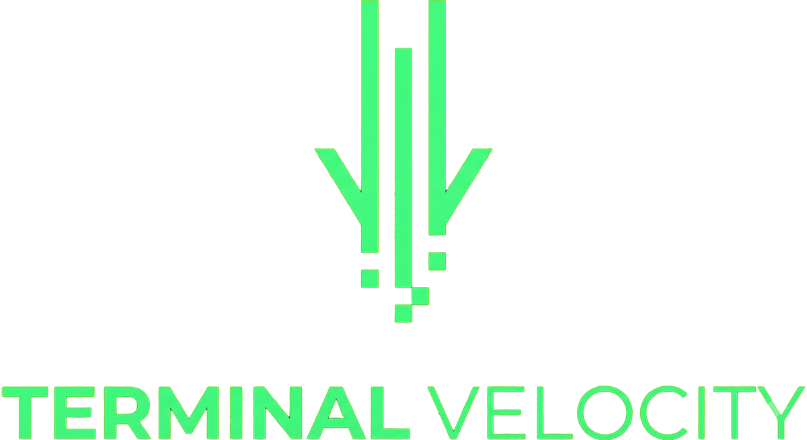
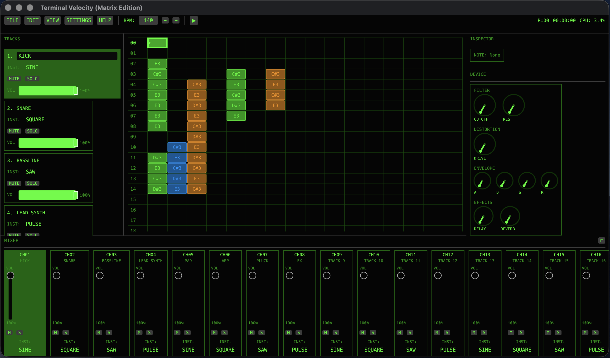

# Terminal Velocity

**Terminal Velocity** is a professional music tracker that combines the precision of traditional trackers with immersive Matrix-style visuals. Built entirely in **Rust** for maximum performance, it provides a modern interface for creating electronic music with real-time audio synthesis and visual feedback.



## ⚡ Concept

In **Play Mode**, the sequencer displays a realistic Matrix rain effect with falling characters synchronized to your music. Each MIDI note triggers visual particles that cascade down the screen.

In **Edit Mode**, the rain freezes and you can edit notes directly in the pattern grid. The interface provides detailed note information, velocity control, and CC parameters for precise sound design.

## 🚀 Tech Stack

This project uses a pure systems-level architecture to ensure zero visual stutter and rock-solid timing.

* **Core Language:** [Rust](https://www.rust-lang.org/) (Memory safety without Garbage Collection)
* **Graphics Engine:** [Bevy](https://bevyengine.org/) with WGPU (WebGPU Native)
* **Audio Backend:** [cpal](https://github.com/RustAudio/cpal) - Low-level audio device access
* **UI Layer:** [egui](https://github.com/emilk/egui) - Immediate Mode GUI
* **MIDI Support:** [midir](https://github.com/Boddlnagg/midir) - MIDI input/output
* **Architecture:** Entity Component System (ECS) for efficient data processing

## 🎮 Controls

### Navigation
* **↑ ↓ ← →** : Move cursor in pattern editor
* **SPACE** : Play/Stop playback
* **ENTER** : Toggle Edit Mode

### Note Entry (Edit Mode)
* **Z S X D C V G B H N J M ,** : Play notes (C to B)
* **BACKSPACE/DELETE** : Delete note
* **Mouse Click** : Place/select notes in pattern grid

### File Operations
* **CTRL+S** : Save project
* **CTRL+O** : Load project

## 🎛 Features

### Pattern Editor
* **16 Channels** : Multi-track sequencing with independent instruments
* **64 Rows per Pattern** : Flexible pattern length
* **Detailed Note Display** : Shows note name, velocity, and CC values
* **Visual Feedback** : Color-coded notes by instrument type
* **Real-time Playback** : See your pattern play with visual playhead

### Audio Engine
* **4 Instrument Types** : Sine, Square, Saw, and Pulse waves
* **Per-Channel Instruments** : Each track can use a different waveform
* **Velocity Control** : 0-127 velocity range
* **BPM Control** : Adjustable tempo (60-200 BPM)
* **Real-time Synthesis** : Low-latency audio generation

### Mixer
* **16-Channel Mixer** : All channels visible side-by-side
* **Volume Control** : Per-channel volume sliders
* **Mute/Solo** : Individual track control
* **Instrument Selection** : Change instrument per channel

### Device Controls
* **Filter** : Cutoff and Resonance controls
* **Distortion** : Drive control
* **ADSR Envelope** : Attack, Decay, Sustain, Release
* **Effects** : Delay and Reverb

### Visuals
* **Matrix Rain Animation** : Realistic falling characters during playback
* **Trailing Effects** : Characters fade with trailing glow
* **Theme System** : 5 professional themes (Matrix, Cyberpunk, Monochrome, Neon, Professional)
* **Color-Coded Notes** : Visual distinction by instrument type

### User Interface
* **Professional Design** : Minimal, clean interface
* **Tooltips** : Hover hints explain all controls
* **Settings Panel** : Theme selection and keyboard shortcuts
* **File Dialogs** : Save/Load project dialogs
* **MIDI Configuration** : MIDI device selection and status

## 🛠 Architecture Overview

The application runs on multiple execution contexts to ensure audio stability:

1. **The Audio Thread (Real-time priority):**
   * Cycles at hardware sample rate (44.1kHz)
   * Uses lock-free channels for command passing
   * No memory allocation during playback

2. **The Main/Render Thread:**
   * Handles Input (Mouse/Keyboard/MIDI)
   * Runs the ECS Systems (Playback, Editor)
   * Renders UI overlay via `egui`
   * Manages Matrix visual effects

3. **MIDI Thread:**
   * Listens for MIDI input events
   * Passes events to main thread via channels

## 📦 Building from Source

**Prerequisites:**
* [Rust Toolchain](https://rustup.rs/) (latest stable)
* Vulkan SDK (Windows/Linux) or Xcode Command Line Tools (macOS)

```bash
# Clone the repository
git clone https://github.com/frangedev/terminal-velocity.git
cd terminal-velocity

# Run in Release mode (CRITICAL for audio performance)
# Debug builds will be too slow for real-time DSP
cargo run --release
```

## 🎨 Themes

Terminal Velocity includes 5 professional themes:
* **Matrix** : Classic green on black (default)
* **Cyberpunk** : Magenta/cyan/yellow color scheme
* **Monochrome** : White/gray professional look
* **Neon** : Cyan/magenta/yellow vibrant colors
* **Professional** : Blue/orange modern design

Change themes via **SETTINGS → Settings → Theme**

## 🗺 Roadmap

* [x] **Core:** WGPU render loop & Windowing
* [x] **Audio:** Real-time synthesis with cpal
* [x] **Visuals:** Matrix Rain particle system
* [x] **UI:** egui integration with professional design
* [x] **Editor:** Pattern editing with mouse/keyboard
* [x] **Persistence:** Save/Load sequences to JSON
* [x] **Mixer:** 16-channel mixer with volume/mute/solo
* [x] **Themes:** Multiple color themes
* [x] **MIDI:** MIDI input support
* [x] **Device Controls:** Filter, distortion, ADSR, effects
* [ ] **MIDI Output:** Send MIDI to external devices
* [ ] **Pattern Chain:** Multiple patterns in sequence
* [ ] **Export:** Audio export to WAV/MP3

## 👤 Author

**Mehmet T. AKALIN**

* **GitHub:** [makalin](https://github.com/makalin)
* **Company:** [Digital Vision](https://dv.com.tr)
* **LinkedIn:** [Mehmet T. AKALIN](https://www.linkedin.com/in/makalin/)
* **X / Twitter:** [@makalin](https://x.com/makalin)

---

*Licensed under the MIT License.*
